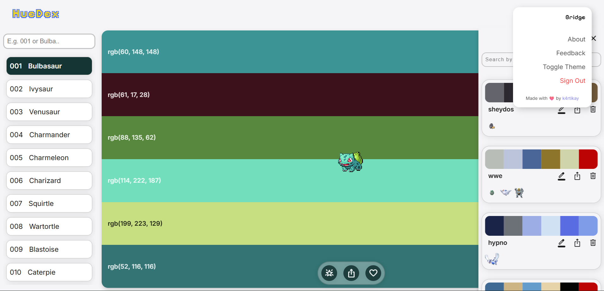

<h1>
  
  HueDex
</h1>

> A Pokémon-themed color palette generator inspired by Coolors. Instantly create and save color schemes extracted directly from normal and shiny Pokémon sprites.


**Live At:** [https://pokebooknew.netlify.app/]

---

<p align="center">
  
  <br>
  <em>The main page on desktop in light theme.</em>
</p>

<p align="center">
  
  <br>
  <em>The main page on desktop in dark theme.</em>
</p>


*A quick demo of the mobile layout and the interactivity*

## Summary

This project was built as a comprehensive, full-stack application to practice and showcase skills in React, state management, API integration, and user authentication. It uses [ColorThief](https://github.com/lokesh/color-thief) to extract a color palette from a Pokémon's sprite, and [tinycolor2](https://github.com/bgrins/TinyColor) to manipulate those colors. Users can create, save, and manage their palettes, all powered by Firebase.

## Key Features

* **Discover Palettes:** Generate palettes from all Pokémon up to Generation 5.
* **Sprite Toggling:** Instantly switch between **Normal** and **Shiny** sprites to see different palettes.
* **Full Palette Control:**
    * Lock your favorite colors.
    * Copy colors in **Hex, RGB, and HSL** formats.
    * Generate different **shades** for any color.
    * Use the **spacebar** for a random new Pokémon palette.
* **Export Options:**
    * Download palettes as **CSS and SCSS** variable files.
    * Copy pre-formatted CSS + SCSS variables directly to your clipboard.
* **User Authentication:**
    * Full Email/Password and Google OAuth integration via Firebase.
    * **Guest Mode** for users who just want to browse.
* **Saved Palettes:** Registered users can save, view, edit, and delete their favorite palettes in their library.
* **Modern UI/UX:**
    * Built **mobile-first** and fully responsive.
    * Includes **Light and Dark** modes.
    * Subtle animations using **Framer Motion**.

## Tech Stack & Libraries

### Core Technologies
* **React:** Used functional components and React Hooks.
* **Context API:** Managed global state (e.g., user auth, theme).
* **Firebase:** Handled user authentication (Auth) and palette storage (Firestore).
* **SCSS:** Used for all styling, organized with a modular architecture.
* **Framer Motion:** Implemented for page transitions and micro-interactions.

### Key Libraries
* **PokéAPI:** Fetched all Pokémon data and sprite URLs.
* **ColorThief:** Extracted the primary color palette from sprite images.
* **tinycolor2:** Manipulated colors to generate shades and variations.
* **Radix UI:** Powered the accessible tooltip components.
* **react-syntax-highlighter:** Formatted the CSS/SCSS code for the export feature.

## Local Setup

To run this project locally, follow these steps:

1.  **Clone the repository:**
    ```bash
    git clone [https://github.com/](https://github.com/)[k4rtikay]/[pokedex].git
    cd [pokedex]
    ```

2.  **Install dependencies:**
    ```bash
    npm install
    ```

3.  **Set up Firebase:**
    * Create a new project in your [Firebase Console](https://console.firebase.google.com/).
    * Set up **Authentication** (enable Email/Password and Google).
    * Set up **Cloud Firestore** database.
    * Go to Project Settings > General and find your web app's config object.
    * Create a `.env.local` file in the root of the project and paste your keys in this format (Vite is used here):

    ```
    VITE_FIREBASE_API_KEY=your_api_key
    VITE_FIREBASE_AUTH_DOMAIN=your_auth_domain
    VITE_FIREBASE_PROJECT_ID=your_project_id
    VITE_FIREBASE_STORAGE_BUCKET=your_storage_bucket
    VITE_FIREBASE_MESSAGING_SENDER_ID=your_sender_id
    VITE_FIREBASE_APP_ID=your_app_id
    VITE_FIREBASE_MEASUREMENT_ID=your_measurement_id
    ```

4.  **Run the application:**
    ```bash
    npm start
    ```
    The app will be available at the designated localhost port.

## Challenges & Future Improvements

This was my first major project built with React, and it was an incredible learning experience. While I'm proud of the final product, I'm also aware of several areas I would improve in a future refactor.

* **Refactor Bloated Components:** Some components (like the main Palette generator) grew too large and handle too much logic. I plan to break these down into smaller, single-responsibility components to improve readability and maintenance.
* **Custom Hooks vs. Helpers:** I created a custom hook that could be simplified into a pure helper function, as it doesn't rely on state or lifecycle methods. This would improve code separation.
* **Naming Conventions:** As the project grew, my naming conventions for components and functions became inconsistent. I would enforce a stricter naming strategy (e.g., BEM for SCSS, consistent file names) from the start.

This project taught me the importance of planning component architecture *before* writing code, and I look forward to applying these lessons to my next project.

## Acknowledgements

* **Inspiration:** [Coolors.co](https://coolors.co/)
* **Data:** [PokéAPI](https://pokeapi.co/)
* **Color Extraction:** [ColorThief](https://github.com/lokesh/color-thief) by Lokesh Dhakar

---